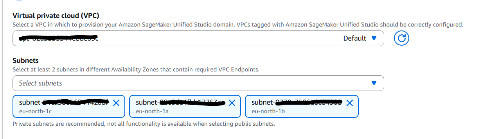
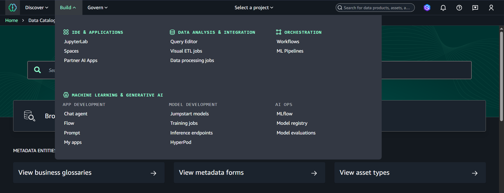
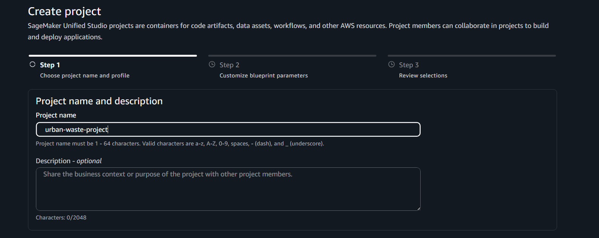

# Automated Detection and Spatial Analysis of Illegal Waste Sites with CNNs

A deep learning approach to automatically classify aerial images and identify areas with illegal waste accumulation in urban environments.

----
## 1. Problem Statement

### Background
Illegal waste dumping and accumulation in urban areas is a significant environmental and public health concern. Traditional monitoring methods rely on manual inspections, which are costly, slow, and often incomplete. Rapid detection of waste hotspots using aerial imagery and machine learning can help city planners, environmental authorities, and public health agencies make faster, data-driven decisions to manage and mitigate waste effectively.

### Objectives
- Develop a **binary image classification model** to detect the presence of illegal waste sites (waste vs. no-waste).
- Train and compare **multiple CNN-based models** using transfer learning.
- Perform **exploratory data analysis (EDA)** on aerial images and annotations.
- Build a **reproducible training pipeline** suitable for cloud execution.
- Deploy the trained model as a **containerized inference service** on AWS.

### Challenges
- Large image sizes and high storage requirements.
- Class imbalance between waste and non-waste images.
- Variability in lighting, resolution, and background patterns across images.
- Limited availability of pixel-level annotations for all images.

### Expected Outcome
- Trained CNN models capable of accurately classifying aerial images as **waste / no-waste**.
- Quantitative comparison of multiple model architectures and hyperparameters.
- A containerized inference API deployable via AWS Lambda.
- A fully reproducible, cloud-based ML pipeline.
.....
  
----
## 2. Dataset Description

**Source:** [AerialWaste Dataset](https://aerialwaste.org/)

The AerialWaste dataset is a large-scale dataset designed for landfill discovery and waste detection using aerial and satellite imagery.

### Dataset Characteristics
- Approximately **11,700 aerial images** collected from multiple geographic regions.
- Images distributed across multiple folders (`images0` – `images5`).
- COCO-style JSON annotations provided for training and testing.

### Annotation Types
- **Binary classification:** Presence or absence of waste in an image.
- **Multi-label annotations:** Types of waste objects present (subset of images).
- **Segmentation masks:** Polygon annotations around waste objects (subset of images).

> **Note:**  
> The primary focus of this project is **binary image classification**.  
> Segmentation annotations are explored during EDA and discussed as a future extension.

### Citation
```bibtex
@article{torres2023aerialwaste,
  title={AerialWaste dataset for landfill discovery in aerial and satellite images},
  author={Torres, Rocio Nahime and Fraternali, Piero},
  journal={Scientific Data},
  volume={10},
  number={1},
  pages={63},
  year={2023},
  publisher={Nature Publishing Group UK London}
}
```
....

----
## 3. Technology Stack

| Layer                   | Tools / Libraries                                    |
| ----------------------- | ---------------------------------------------------- |
| **Language**            | Python 3.10+                                         |
| **Data Processing**     | pandas, numpy, pycocotools, OpenCV                   |
| **Visualization**       | matplotlib, seaborn                                  |
| **Modeling**            | PyTorch, torchvision, timm (transfer learning), ONNX |
| **Training Platform**   | AWS SageMaker                                        |
| **Web Framework**       | FastAPI                                              |
| **Model Serialization** | TorchScript, ONNX                                    |
| **Containerization**    | Docker                                               |
| **Cloud Deployment**    | AWS Lambda, AWS ECR, AWS API Gateway                 |
| **Version Control**     | Git, GitHub                                          |


----
## 4. Folder Structure


----
## 5. Application Workflow

### 1. Set Up AWS 

1. Create a User account 
2. Attach policies directly to give permissions 
3. Select the below:


### 2. Upload images to AWS S3

```bash 
aws s3 sync "path/to/local/aerial-dataset" s3://urban-waste-cnn/AerialWaste --exact-timestamps --quiet 
```
Note: Replace the "path/to/local/aerial-dataset" with the actual local path. 


### 3. Train the model with AWS Sagemaker (Optional) 


Go to Amazon Sagemaker -> Create a Domain (from the left side bar/panel)

In the Quick Settings select:

- Domain name: `urban-waste-domain` 
- Default VPC with all subnets 



- For Domain Execution Role, Domain Service role, and all of the options pertaining to Service roles, keep `Create and use a new service role`

- Ignore Generative AI / Bedrock options

Then, go to Unified Studio -> build -> IDE and application -> Jupyter Lab -> Create a new project



Name the project: `urban-waste-project`



Click on create project without changing anything else. In a few minutes, your project will be ready. 


----
## 6. Instructions to Reproduce


----
## 7. Future Enhancements
