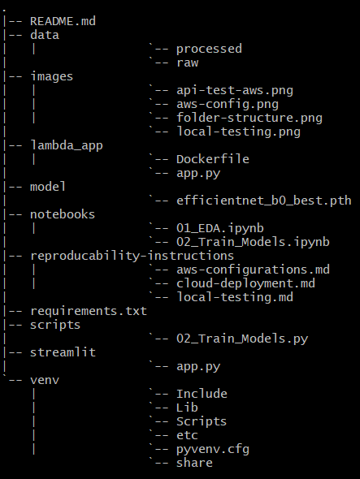
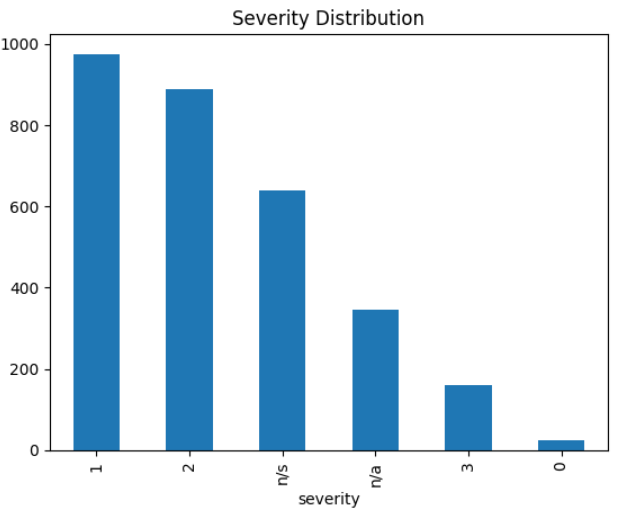
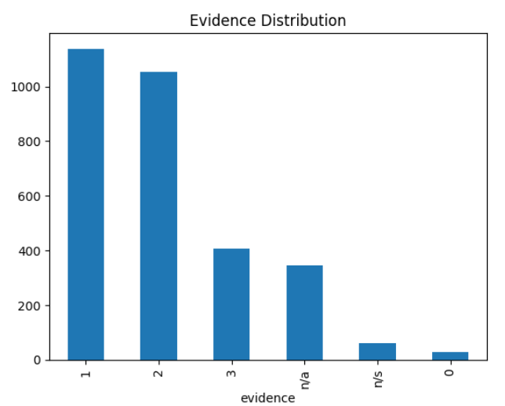
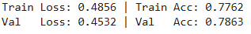
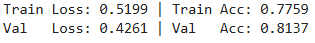
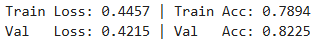
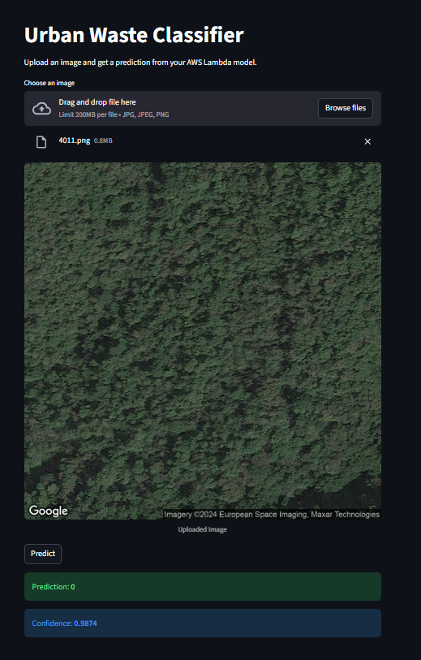

# Automated Detection and Spatial Analysis of Illegal Waste Sites with CNNs

A deep learning approach to automatically classify aerial images and identify areas with illegal waste accumulation in urban environments.


----
## 1. Problem Statement

### Background
Illegal waste dumping and accumulation in urban areas is a significant environmental and public health concern. Traditional monitoring methods rely on manual inspections, which are costly, slow, and often incomplete. Rapid detection of waste hotspots using aerial imagery and machine learning can help city planners, environmental authorities, and public health agencies make faster, data-driven decisions to manage and mitigate waste effectively.

### Objectives
- Develop a **binary image classification model** to detect the presence of illegal waste sites (waste vs. no-waste).
- Train and compare **multiple CNN-based models** using transfer learning.
- Perform **exploratory data analysis (EDA)** on aerial images and annotations.
- Build a **reproducible training pipeline** suitable for cloud execution.
- Deploy the trained model as a **containerized inference service** on AWS.

### Challenges
- Large image sizes and high storage requirements.
- Class imbalance between waste and non-waste images.
- Variability in lighting, resolution, and background patterns across images.
- Limited availability of pixel-level annotations for all images.

### Expected Outcome
- Trained CNN models capable of accurately classifying aerial images as **waste / no-waste**.
- Quantitative comparison of multiple model architectures and hyperparameters.
- A containerized inference API deployable via AWS Lambda.
- A fully reproducible, cloud-based ML pipeline.
.....
  
----
## 2. Dataset Description

**Source:** [AerialWaste Dataset](https://aerialwaste.org/)

The AerialWaste dataset is a large-scale dataset designed for landfill discovery and waste detection using aerial and satellite imagery.

### Dataset Characteristics
- Images collected from multiple geographic regions.
- Images distributed across multiple folders (`images0` – `images5`).
- COCO-style JSON annotations provided for training and testing.

### Annotation Types
- **Binary classification:** Presence or absence of waste in an image.
- **Multi-label annotations:** Types of waste objects present (subset of images).
- **Segmentation masks:** Polygon annotations around waste objects (subset of images).

> **Note:**  
> The primary focus of this project is **binary image classification**.  
> Segmentation annotations are explored during EDA and discussed as a future extension.

### Citation
```bibtex
@article{torres2023aerialwaste,
  title={AerialWaste dataset for landfill discovery in aerial and satellite images},
  author={Torres, Rocio Nahime and Fraternali, Piero},
  journal={Scientific Data},
  volume={10},
  number={1},
  pages={63},
  year={2023},
  publisher={Nature Publishing Group UK London}
}
```

----
## 3. Technology Stack

| Layer                   | Tools / Libraries                                    |
| ----------------------- | ---------------------------------------------------- |
| **Language**            | Python 3.10+                                         |
| **Data Processing**     | pandas, numpy                                        |
| **Visualization**       | matplotlib, seaborn                                  |
| **Modeling**            | PyTorch, torchvision, timm (transfer learning)       |
| **Web Framework**       | Streamlit, Streamlit Cloud                           |
| **Containerization**    | Docker                                               |
| **Cloud Deployment**    | AWS Lambda, AWS ECR, AWS API Gateway                 |
| **Version Control**     | Git, GitHub                                          |


----
## 4. Folder Structure



----
## 5. Application Workflow

The overall workflow of the Urban Waste Detection system spans data exploration,
model inference, cloud deployment, and user-facing interaction.  
The pipeline is designed to ensure reproducibility, scalability, and ease of use
for both technical and non-technical users.

### 5.1. Data Collection and Preprocessing

The dataset consists of aerial images annotated for waste presence, provided with
JSON files defining training and testing splits.

Key preprocessing steps include:
- Resolving image paths across multiple image directories
- Filtering missing or invalid image files
- Mapping annotations to a binary classification task
  (waste vs no-waste)
- Shuffling data with a fixed random seed
- Limiting the dataset size to ensure feasible CPU-based training

Images are resized and normalized to match pretrained CNN input requirements.\

### 5.2. Exploratory Data Analysis (EDA)

Exploratory analysis is performed to understand dataset characteristics and
potential sources of bias.

EDA includes:
- Class distribution analysis (waste vs no-waste)

- Waste presence across different site types


- Distribution of severity and evidence labels


  
- Visual inspection of sample images

### 5.3. Model Training and Tuning

Multiple pretrained convolutional neural networks are evaluated using transfer
learning. For all models, the backbone is frozen and only the classifier layers
are fine-tuned.

#### Model 1: ResNet-18
A pretrained ResNet-18 backbone was fine-tuned for binary classification (waste vs no-waste).  
The backbone layers were frozen, and only the classifier layers were trained.

**Results:**  


> Full training logs are available in the [training notebook](./notebooks/02_Train_Models.ipynb).

#### Model 2: ResNet-50
A deeper ResNet-50 model was fine-tuned similarly to ResNet-18.

**Hyperparameters Tuned:**Learning rate, Dropout rate, Epochs  

**Results:**  


> Full training logs are available in the [training notebook](./notebooks/02_Train_Models.ipynb).

#### Model 3: EfficientNet-B0
EfficientNet-B0 was fine-tuned with only the classifier layers.

**Hyperparameters Tuned:**Learning rate, Dropout rate, Epochs  

**Results:**  


> Full training logs are available in the [training notebook](./notebooks/02_Train_Models.ipynb).

**EfficientNet-B0 achieved the best validation performance and was selected as the final model.**

### 5.4. Model Deployment and User Interaction

- **Local Inference Validation (Docker):**  
  Enables rapid testing of the inference pipeline using the Lambda Runtime
  Interface Emulator prior to cloud deployment.

- **Serverless Cloud Inference (AWS Lambda + AWS API Gateway + AWS ECR):**  
  The model is packaged into a Lambda-compatible container and deployed for
  scalable, on-demand inference via an API Gateway endpoint.

- **User-Facing Application (Streamlit Cloud):**  
  A web-based interface allows users to upload images and receive real-time
  predictions through the deployed cloud API.

This deployment pipeline ensures consistency between local testing, cloud
execution, and end-user interaction.

----
## 6. Instructions to Reproduce

This section provides a **complete, end-to-end guide** to reproducing the deployed machine learning inference system, from local container-based testing to cloud deployment on **AWS Lambda** and public access via **API Gateway**.  
The final inference API is additionally integrated into a **Streamlit Cloud application** for user-facing testing and validation.

**Section Overview**:

[**6.1. System Requirements**](#61-system-requirements)

[**6.2. AWS Identity and Access Management (IAM)**](#62-aws-identity-and-access-management-iam)

[**6.3. Repository Setup**](#63-repository-setup)

[**6.4. Local Inference Testing**](#64-local-inference-testing)

[**6.5. Cloud Deployment (AWS)**](#65-cloud-deployment-aws)

[**6.6. Streamlit Cloud Deployment**](#66-streamlit-cloud-deployment-user-facing-validation)


### 6.1. System Requirements

The following tools and services are required:

- **Docker ≥ 20.x**
- **AWS CLI ≥ 2.x**
- **Python ≥ 3.9**
- An active **AWS account** with permissions to create IAM users, roles, Lambda functions, ECR repositories, and API Gateway resources
- A **Streamlit Cloud account** (optinally, if you wish to deploy this project yourself.)


### 6.2. AWS Identity and Access Management (IAM)

For instructions on AWS configurations and IAM, check out:

[📄 aws-configurations.md](./reproducability-instructions/aws-configurations.md)


### 6.3. Repository Setup

First, clone the repository and set up a local Python virtual environment.

**Step 1: Clone the repository**
```bash
git clone https://github.com/<your-username>/<your-repository>.git
cd <your-repository>
```

**Step 2: Create and activate a virtual environment**

```bash
python -m venv venv
```
```bash
source venv/bin/activate #macos/linux
# or 
venv\Scripts\activate #windows
``` 

**Step 3: Install dependencies**

```bash
pip install --upgrade pip
pip install -r requirements.txt
```


### 6.3. Local Inference Testing

For instructions on local containerized inference testing, check out:

 [📄 local-testing.md](./reproducability-instructions/local-testing.md)


### 6.4. Cloud Deployment (AWS)

For instructions on deploying the ML project on AWS, check out:

[📄 cloud-deployment.md](./reproducability-instructions/cloud-deployment.md)


### 6.5. Streamlit Cloud Deployment (User-Facing Validation)

To enable non-technical users to interact with the model, the AWS API endpoint is integrated into a Streamlit Cloud application.

Overview

- The Streamlit app provides an image upload interface
- Uploaded images are Base64-encoded client-side
- Requests are forwarded to the AWS API Gateway /predict endpoint
- Predictions are displayed in real time

🔗 **Live Demo of my app:**  
https://urban-waste-cnn.streamlit.app/



> **Note:** This Streamlit application and its backing AWS infrastructure
> (Lambda function and API Gateway) are **temporarily active** for demonstration
> and evaluation purposes. Long-term availability is not guaranteed, but the
> complete setup and deployment process is fully documented to allow
> reproduction.

> To create your own Streamlit deployment, connect a Streamlit Cloud app to the
> project repository and add the AWS API endpoint as a secret variable
> (`API_URL`).

----
## 7. Future Enhancements

- Expanding the training dataset with additional labeled images to improve model generalization
- GPU-backed inference (Amazon ECS or SageMaker)
- Batch inference pipelines for large-scale evaluation
- Model versioning
- CI/CD automation for retraining and redeployment