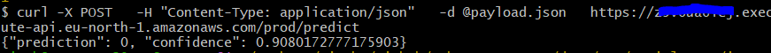

**1. Install and Configure AWS CLI**
Download and install AWS CLI for your OS.

**2. Verify Installation**

```bash
aws --version
```

**3. Configure AWS CLI**

```bash
aws configure
```

Provide the below (generated in step 6.2):

- AWS Access Key ID  
- AWS Secret Access Key  
- Region  
- Output format (optional)


---

**4. Create an ECR Repository**

```bash
aws ecr create-repository \
  --repository-name urban-waste-lambda \
  --region <REGION>
```

You will receive:

- `repositoryArn`
- `repositoryUri`

---

**5. Authenticate Docker with Amazon ECR**

```bash
aws ecr get-login-password --region <REGION> \
  | docker login --username AWS --password-stdin <ACCOUNT_ID>.dkr.ecr.<REGION>.amazonaws.com
```

To find your AWS Account ID, run the below:

```bash
aws sts get-caller-identity
```

---

**6. Tag the Docker Image for ECR**

```bash
docker tag urban-waste-lambda:latest \
  <ACCOUNT_ID>.dkr.ecr.<REGION>.amazonaws.com/urban-waste-lambda:latest
```

Verify:

```bash
docker images
```

You should see:

- `urban-waste-lambda`
- `<ACCOUNT_ID>.dkr.ecr.<REGION>.amazonaws.com/urban-waste-lambda`

---
**7. Push the Image to ECR**

```bash
docker push <ACCOUNT_ID>.dkr.ecr.<REGION>.amazonaws.com/urban-waste-lambda:latest
```

This may take a few minutes.

---

**8. Create the Lambda Function (Console)**

1. Open **AWS Console → Lambda**
2. Click **Create function**
3. Choose **Container image**
4. Fill in:
   - **Function name:**  
     `urban-waste-inference`
   - **Container image:**  
     Click **Browse images** → select your ECR repo → choose `latest`
5. **Architecture:**  
   `x86_64`
6. **Permissions:**  
   - Select **Use an existing role**
   - Choose:  
     `lambda-execution-role`
7. Click **Create function**

AWS will now pull your container image from ECR and deploy the Lambda.

---
**10. Update Config Settings**

Inside the Lambda console:
1. 	Go to Configuration → General configuration
2. 	Click Edit
3. 	Set:
  - Memory: 1024 MB
  - Timeout: 1 minute/60 seconds
4. 	Save

--- 
**11. Test the Lambda Function (Console Test Event)**

Create a test event:
- Go to Test tab
- Click Create new event
- Name it: `local-image-test`
- Use this JSON:
```json
{
  "body": "{\"image\": \"<BASE64_STRING>\"}"
}
```
> You can use the same `payload.json` we created earlier during local testing.

---
**12. Expose API Gateway (via Console)**

  1. Go to API Gateway and click on `Create API`
  2. Choose:
  - Select HTTP API
  - Click Build
  3. In Develop Settings:
    - Go to Integrations > Select `Manage Integrations`
      - Integration type: `Lambda`
      - Choose your function: `urban-waste-inference`
    
    - Go to Routes
      - Method: `POST`
      - Resource path: `/predict`
  4. In Deploy Settings:
    - Go to Stages
      - Stage Name: `Prod`
      - Click **Deploy**

  API Gateway will now generate a public endpoint like: `https://<api-id>.execute-api.<region>.amazonaws.com/prod/predict
  `

  5. Test the API endpoint in Postman or run the below command
  
  ```bash
  curl -X POST \
  -H "Content-Type: application/json" \
  -d @payload.json \
  https://abc123xyz.execute-api.eu-north-1.amazonaws.com/prod/predict
  ```
 