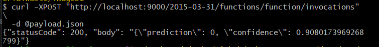

1. **Build the Docker Image (from project root)**

> **Important:** Run this from the **project root**, i.e urabn-waste-cnn and not inside `lambda_app/`.

Use the Lambda‑compatible build command:

```bash
DOCKER_BUILDKIT=0 docker build \
  --platform linux/amd64 \
  -f lambda_app/Dockerfile \
  -t urban-waste-lambda \
  .
```

2. **Ensure Docker Image Compatibility with AWS Lambda**

```bash
docker image save urban-waste-lambda | docker image load
```

3. **Run the Container Locally**

```bash
docker run -p 9000:8080 urban-waste-lambda
```
This starts the Lambda Runtime Interface Emulator and exposes a local HTTP endpoint.

4. **Send a Test Request**

  Open a second terminal:

  1. Navigate to the directory containing your test image.

  2. Convert the image to Base64:

  ```bash
  base64 500.png | tr -d '\n' > image.b64
  ```

  3. Construct the Lambda event payload:

  ```bash
  B64=$(cat image.b64)

  cat > payload.json << EOF
  {
    "body": "{\"image\": \"${B64}\"}"
  }
  EOF
  ```

  5. Invoke the local Lambda runtime:

  ```bash
  curl -XPOST "http://localhost:9000/2015-03-31/functions/function/invocations" \
    -d @payload.json
  ```

  Replace `500.png` with your own image file.

  

